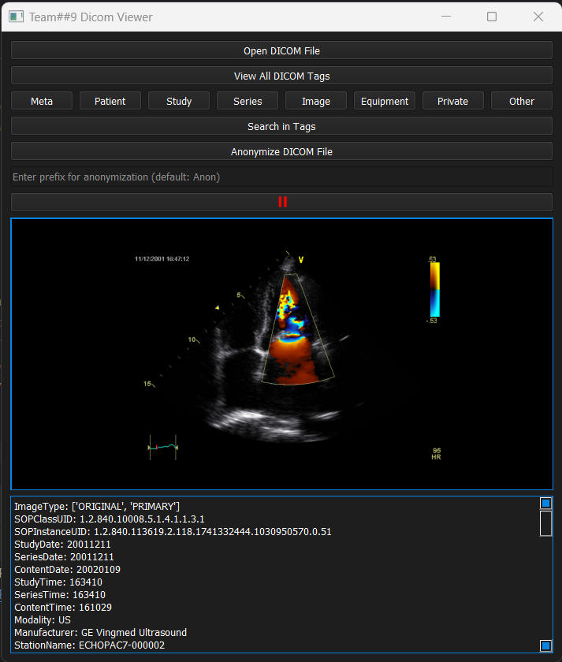

<p align="center">
  <a href="" rel="noopener">
    


</p>
<p align="center">
    <br> 
</p>
<div align="center">

[](https://github.com/hamdy-cufe-eng/Dicom-Viewer/contributors)
[](https://github.com/hamdy-cufe-eng/Dicom-Viewer/issues)
[](https://github.com/hamdy-cufe-eng/Dicom-Viewer/network)
[](https://github.com/hamdy-cufe-eng/Dicom-Viewer/stargazers)
[](https://github.com/hamdy-cufe-eng/Dicom-Viewer/blob/main/LICENSE)

</div>

## About

 Help the Snail to return to its home after being lost in the galaxy.
 Help him by avoid collision with Mr Craps and Make him get more coins to get new high score.


## 🏁 Get Started <a name = "Install"></a>
1. **Clone the repository**
```
git clone https://github.com/hamdy-cufe-eng/Dicom-Viewer.git
```
2. **Install Visual Studio Code || PyCharm**


3. **Open the folder in Visual Studio Code**


4. **Build the project**


5. **You can run through**


## 💻 Built Using <a name = "tech"></a>
- [Python]()
- [numpy](https://numpy.org/)
- [pydicom](https://pydicom.github.io/)
- [matplotlib](https://matplotlib.org/)
- [PyQt5]()

## 💻 How to start

### Usage :
- After compiling the project , try to load the desired file (M2D ,2D,3D) using the **Open DICOM File** button
- Click **View All DICOM Tags** to view all tags 
- You can use search for a specifec keyword in the tags 


## 📷 Screenshots

<div name="Screenshots" align="center">
   
   <hr>
    
    <hr>
  
   
   <hr>
  
   
   <hr>
</div>

## Contributors
<table align="center">
  <tr>
    <td align="center">
    <a href="https://github.com/mariemzayn18" target="_black">
    
    <br />
    <sub><b>Mariem Muhammed</b></sub></a>
    </td>
    <td align="center">
    <a href="https://github.com/Marim1611" target="_black">
    
    <br />
    <sub><b>Marim Naser</b></sub></a>
    </td>
     <td align="center">
    <a href="https://github.com/abeerhbadr" target="_black">
    
    <br />
    <sub><b>Abeer Hussein</b></sub></a>
    </td>
     <td align="center">
    <a href="https://github.com/mhmdahmedfathi" target="_black">
    
    <br />
    <sub><b>Mohamed Ahmed</b></sub></a>
    </td>
  </tr>
 </table>
